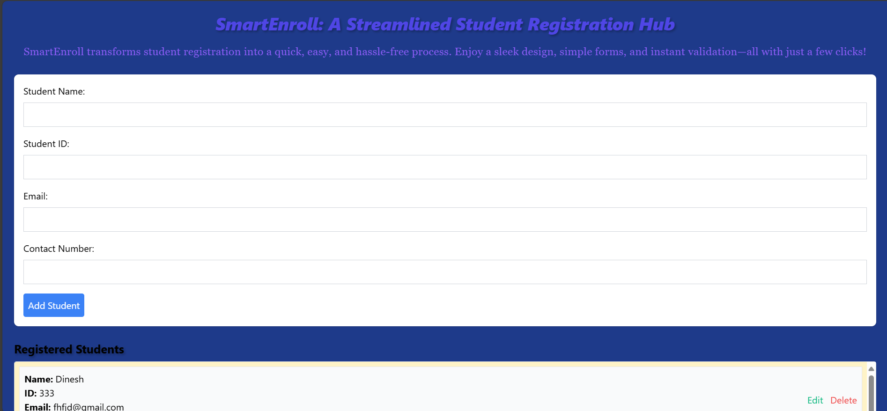
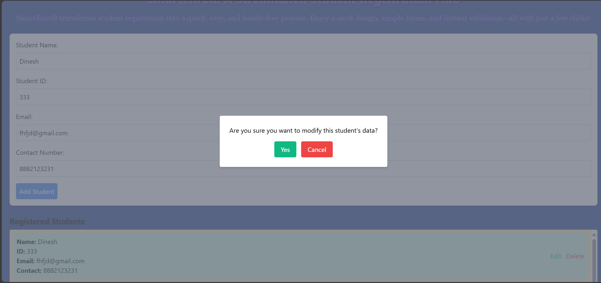
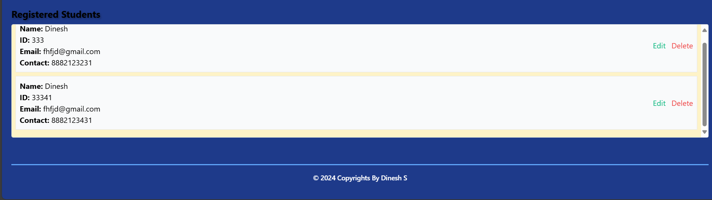
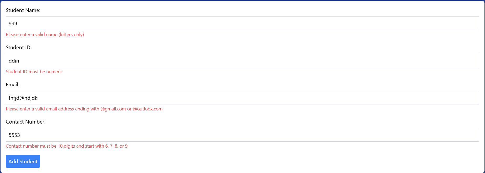
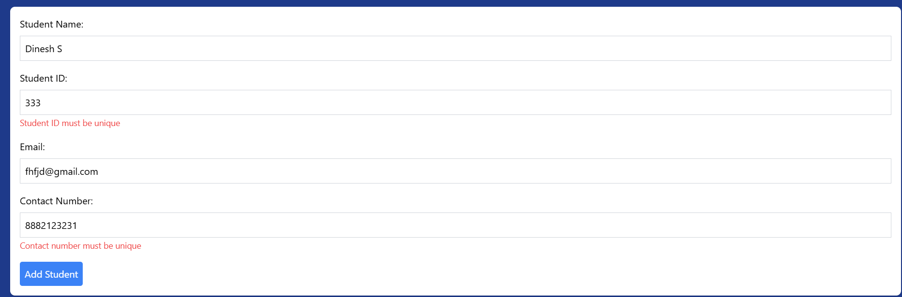
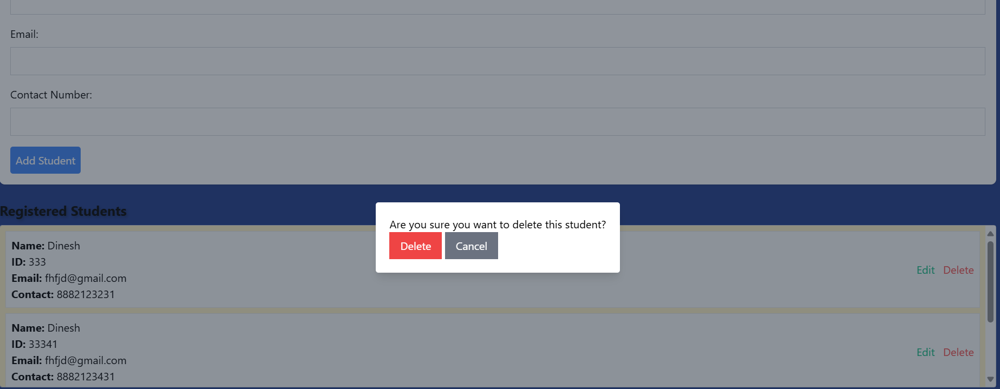

Here's a detailed **README** file for your **Student Registration System** assignment that includes icons, a comprehensive description, and step-by-step instructions to make it engaging for users:

---

# 📚 Student Registration System

A **simple** and **intuitive** web-based Student Registration System developed using **JavaScript**. This application is designed for educational purposes, showcasing JavaScript functionalities and web development concepts in a practical way. Users can register students, validate form inputs, and manage student data effortlessly. 


---

## 📝 Features

- **Interactive User Interface** with form validation.
- **Student Registration**: Add new student details with ease.
- **Real-time Validation**: Ensure data accuracy and prevent invalid inputs.
- **Local Storage**: Saves student data locally on the browser.
- **Responsive Design**: Works on all screen sizes.
- **User-Friendly**: Simple and intuitive to use.

---

## 🚀 Getting Started

Follow these steps to get the project running locally on your system.

### Prerequisites

Make sure you have the following installed:
- A modern browser (Chrome, Firefox, etc.)
- Node.js (Optional, for serving with npm)

### Step-by-Step Installation

1. **Clone the repository:**

   ```bash
   git clone https://github.com/Master-dinesh/student-registration-system.git
   ```

2. **Navigate to the project folder:**

   ```bash
   cd student-registration-system
   ```

3. **Install the dependencies (if applicable):**

   If you're using any dependencies, run the following command:

   ```bash
   npm install
   ```

4. **Open the project:**

   Simply open the `index.html` file in your browser.

   Or, if using npm, run:

   ```bash
   npm run start
   ```

5. **You're all set!** Start adding students and explore the functionalities.

---
## 🖼️ Screenshots

Here are some screenshots of the application in action:
## 🖼️ Screenshots

Here are some screenshots of the application in action:











## ⚙️ Technologies Used

- **JavaScript** for dynamic functionality.
- **HTML** for structuring the web page.
- **CSS** for styling and responsiveness.
- **Local Storage** for storing student data on the user's device.

---

## 📧 Contact

For any inquiries or feedback, feel free to reach out at **dinesh.suresh2001@gmail.com**.

---

## 🌟 Contributions

Contributions are welcome! Please feel free to submit a pull request to improve the project.

---

By incorporating icons, a clean structure, and clear instructions, this README is visually engaging and easy for users to follow. Feel free to adjust the demo link and screenshots once your project is hosted and images are ready!
